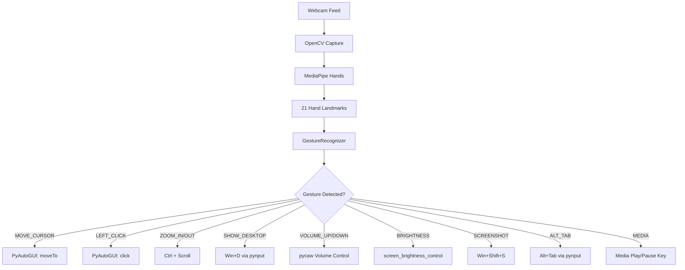

# 🖐️ Hand Gesture Control System — Complete Gesture Guide

> [!IMPORTANT]
> This document describes **every gesture** recognized by the system, what action it triggers, and tips for performing it reliably.

---

## Quick Reference Table

| # | Gesture | Fingers Used | Action | Cooldown |
|---|---------|-------------|--------|----------|
| 1 | ☝️ Index Finger Up | Index only | **Move Cursor** | — |
| 2 | 👌 Index Touches Thumb | Index tip → Thumb tip | **Left Click** | 0.4s |
| 3 | 👌👌 Quick Double Touch | Index tip → Thumb tip (×2) | **Double Click** | 0.35s window |
| 4 | ✌️ Peace Sign | Index + Middle | **Right Click** | 0.4s |
| 5 | 🤏 Thumb + Index Pinch (spread) | Thumb + Index spreading | **Zoom In** | — |
| 6 | 🤏 Thumb + Index Pinch (close) | Thumb + Index closing | **Zoom Out** | — |
| 7 | 🖖 Index + Middle + Thumb (up) | Index + Middle + Thumb, move hand | **Scroll Up / Down** | — |
| 8 | ✊ Closed Fist | All fingers closed | **Show Desktop** (Win+D) | 1.5s |
| 9 | 🖐️ Open Palm | All 5 fingers spread | **Restore Windows** (Win+D) | 1.5s |
| 10 | 🤟 Three Fingers | Index + Middle + Ring | **Screenshot** (Win+Shift+S) | 2.0s |
| 11 | 🖖 Four Fingers | Index + Middle + Ring + Pinky | **Task View** (Win+Tab) | 1.5s |
| 12 | 🤙 Shaka / Hang Loose | Thumb + Pinky | **Alt+Tab** (Switch Window) | 1.0s |
| 13 | 👍 Thumb Up Only | Thumb only | **Volume Up** | 0.15s |
| 14 | 🤙 Pinky Up Only | Pinky only | **Volume Down** | 0.15s |
| 15 | ☝️🤘 Thumb + Index + Middle | Thumb + Index + Middle | **Brightness Up** | 0.15s |
| 16 | 🤘 Ring + Pinky Up | Ring + Pinky only | **Brightness Down** | 0.15s |
| 17 | 🖐️→✊ Flash Gesture | Open palm → Close fist quickly | **Media Play/Pause** | — |

---

## Detailed Gesture Descriptions

### 1. ☝️ Move Cursor
```
Fingers: Index UP — all others DOWN
How:     Raise only your index finger. Point it at the screen area 
         you want the cursor to move to.
Action:  Moves the mouse pointer smoothly to follow your fingertip.
```
> [!TIP]
> The cursor position is mapped from your camera frame to your screen. Keep your hand within the camera's field of view for best results. Adjust `FRAME_REDUCTION` in `config.py` to change the active zone.

---

### 2. 👌 Left Click
```
Fingers: Index TIP touches Thumb TIP
How:     While your index finger is extended, bring its tip to touch 
         your thumb tip (like an "OK" gesture).
Action:  Performs a single left mouse click at the current cursor position.
```
> [!NOTE]
> There is a 0.4-second cooldown between clicks to prevent accidental double-firing. Adjust `CLICK_COOLDOWN` in `config.py`.

---

### 3. 👌👌 Double Click
```
Fingers: Index TIP touches Thumb TIP — twice within 0.35 seconds
How:     Quickly tap your index tip to thumb tip twice in succession.
Action:  Performs a double-click (e.g., to open a file).
```

---

### 4. ✌️ Right Click
```
Fingers: Index + Middle UP — Thumb, Ring, Pinky DOWN
How:     Show a "peace sign" (V shape) with only index and middle 
         fingers extended, keep thumb curled.
Action:  Performs a right-click (context menu) at the current cursor position.
```

---

### 5 & 6. 🤏 Zoom In / Zoom Out
```
Fingers: Thumb + Index UP — Middle, Ring, Pinky DOWN
How:     
  • Zoom In:  Start with thumb and index close together, then 
              SPREAD them apart.
  • Zoom Out: Start with thumb and index apart, then PINCH them 
              together.
Action:  Sends Ctrl + Scroll to zoom in/out (works in browsers, 
         image viewers, etc.).
```
> [!TIP]
> The zoom is proportional to the speed of your pinch/spread movement. Slow movement = fine control. Fast movement = rapid zoom.

---

### 7. 🖖 Scroll Up / Scroll Down
```
Fingers: Index + Middle + Thumb UP — Ring, Pinky DOWN
How:     Extend index, middle, and thumb fingers. Then move your 
         hand UP or DOWN.
  • Move hand UP   → Scroll Up
  • Move hand DOWN → Scroll Down
Action:  Scrolls the page/document in the corresponding direction.
```
> [!NOTE]
> Scroll speed is controlled by `SCROLL_SPEED` in `config.py`. The system tracks the vertical movement of your index + middle fingertips.

---

### 8. ✊ Show Desktop (Close Fist)
```
Fingers: ALL fingers CLOSED (fist)
How:     Close your hand into a tight fist.
Action:  Presses Win+D to minimize all windows and show the desktop.
```
> [!WARNING]
> This gesture has a 1.5-second cooldown to prevent repeated toggling. Keep your fist closed for a moment for reliable detection.

---

### 9. 🖐️ Restore Windows (Open Palm)
```
Fingers: ALL 5 fingers SPREAD open
How:     Open your hand wide with all fingers fully extended and spread apart.
Action:  Presses Win+D again to restore all previously minimized windows.
```

---

### 10. 🤟 Screenshot (Three Fingers)
```
Fingers: Index + Middle + Ring UP — Thumb, Pinky DOWN
How:     Extend your index, middle, and ring fingers while keeping 
         thumb and pinky curled.
Action:  Triggers Windows Snipping Tool (Win+Shift+S) for a 
         screenshot selection.
```
> [!NOTE]
> Has a 2-second cooldown to prevent multiple screenshots firing in quick succession.

---

### 11. 🖖 Task View (Four Fingers)
```
Fingers: Index + Middle + Ring + Pinky UP — Thumb DOWN
How:     Extend all four fingers but keep your thumb curled/tucked in.
Action:  Opens Windows Task View (Win+Tab) showing all open windows 
         and virtual desktops.
```

---

### 12. 🤙 Alt+Tab / Switch Window (Shaka)
```
Fingers: Thumb + Pinky UP — Index, Middle, Ring DOWN
How:     Make a "hang loose" / "shaka" gesture by extending only 
         your thumb and pinky finger.
Action:  Performs Alt+Tab to switch to the next open window.
```

---

### 13. 👍 Volume Up (Thumb Up)
```
Fingers: Thumb UP only — all others DOWN
How:     Classic "thumbs up" gesture. Curl all four fingers and 
         extend only your thumb.
Action:  Increases system volume by ~2 dB per detection cycle.
```
> [!TIP]
> Hold the gesture to continuously increase volume. The 0.15-second cooldown provides a smooth ramp-up.

---

### 14. 🤙 Volume Down (Pinky Up)
```
Fingers: Pinky UP only — all others DOWN
How:     Extend only your pinky finger while curling everything else.
Action:  Decreases system volume by ~2 dB per detection cycle.
```

---

### 15. ☝️🤘 Brightness Up
```
Fingers: Thumb + Index + Middle UP — Ring, Pinky DOWN
How:     Extend your thumb, index, and middle fingers while keeping 
         ring and pinky curled.
Action:  Increases screen brightness by 5%.
```

---

### 16. 🤘 Brightness Down
```
Fingers: Ring + Pinky UP — Thumb, Index, Middle DOWN
How:     Extend only your ring and pinky fingers. Keep thumb, index, 
         and middle curled.
Action:  Decreases screen brightness by 5%.
```

---

### 17. 🖐️→✊ Media Play/Pause (Flash Gesture)
```
Fingers: Open palm → Closed fist (within 0.8 seconds)
How:     Start with your hand fully open (all 5 fingers spread), 
         then quickly close it into a fist.
Action:  Toggles media play/pause (works with Spotify, YouTube, etc.).
```
> [!NOTE]
> The system detects the transition from open palm to closed fist. You need to go from a fully open hand to a fist within 0.8 seconds.

---

## Keyboard Shortcuts in the App

| Key | Action |
|-----|--------|
| `q` | Quit the application |
| `h` | Toggle the help overlay on the camera feed |

---

## Tuning & Configuration

All thresholds and behavior can be adjusted in [`config.py`](file:///c:/Users/Ayush/Desktop/Hand-project/config.py):

| Parameter | Default | Description |
|-----------|---------|-------------|
| `CAMERA_INDEX` | `0` | Camera device to use |
| `DETECTION_CONFIDENCE` | `0.7` | MediaPipe hand detection confidence |
| `TRACKING_CONFIDENCE` | `0.7` | MediaPipe hand tracking confidence |
| `SMOOTHING_FACTOR` | `5` | Mouse movement smoothing (higher = smoother) |
| `MOUSE_SPEED_MULTIPLIER` | `1.5` | Cursor speed scaling |
| `CLICK_DISTANCE_THRESHOLD` | `0.04` | How close thumb+index must be for a click |
| `SCROLL_SPEED` | `50` | Scroll speed per frame |
| `FIST_THRESHOLD` | `0.08` | Sensitivity for fist detection |

> [!TIP]
> If gestures are misfiring, try increasing the threshold values. If gestures aren't being detected, try decreasing them.

---

## Architecture Overview



---

## Troubleshooting

| Issue | Solution |
|-------|----------|
| Camera not detected | Change `CAMERA_INDEX` in `config.py` (try `1` or `2`) |
| Cursor too jittery | Increase `SMOOTHING_FACTOR` (try `8` or `10`) |
| Cursor too slow | Increase `MOUSE_SPEED_MULTIPLIER` (try `2.0` or `2.5`) |
| Gestures not detected | Ensure good lighting; lower `DETECTION_CONFIDENCE` to `0.5` |
| Accidental clicks | Increase `CLICK_DISTANCE_THRESHOLD` (try `0.05`) |
| Volume/brightness not working | Ensure `pycaw` and `screen-brightness-control` are installed |
| Keyboard shortcuts fail | Ensure `pynput` is installed and you have permission |

---

> [!CAUTION]
> **Privacy Note:** This application accesses your webcam. It does NOT record, save, or transmit any video data. All processing is done locally in real-time.
